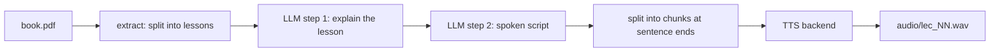

# pdf-book-to-audio

Turns the lessons of a book PDF into spoken audio. The PDF is split into numbered lessons, an LLM explains each lesson in simple words, a second prompt rewrites the explanation as a script for a voice, and a text-to-speech backend produces the audio.

[](../../actions/workflows/tests.yml)

## Pipeline



Output folders: `lessons/`, `explained/`, `scripts/`, `audio/`. Finished files are skipped, so an interrupted run continues where it stopped.

## Features

- **Lesson splitting** with `pdfplumber`. A heading is a line such as `Lesson 5`, `Lecture 5: Title` or `LESSON 5 - Title`. A table-of-contents entry, a sentence that mentions "Lesson 3", and `Lesson 1` versus `Lesson 10` are handled.
- **Backends:** Gemini for the text steps and for speech (voice `Zephyr`), `gtts` (mp3), and `fake` backends for tests and dry runs.
- **Resumable runs,** retries with exponential waits on quota errors (`429` / `RESOURCE_EXHAUSTED`), and failure isolation: one failed lesson is reported and the rest continue.
- **Chunking** of long scripts at sentence ends before each TTS call.
- **Atomic writes:** audio goes to a temporary file and is renamed when complete.
- **Any language** for the explanation (`--language "Roman Urdu"`).

## Run

```bash
pip install -r requirements.txt
export GOOGLE_API_KEY=...            # read from the environment

python -m book_audio book.pdf --out output --language "Roman Urdu"
python -m book_audio book.pdf --extract-only                          # split the PDF, no API calls
python -m book_audio book.pdf --text-backend gemini --tts-backend gtts --start 5 --end 8
```

Input: a PDF with a text layer whose lessons start with a `Lesson N` or `Lecture N` heading. Model names can be changed with `GEMINI_TEXT_MODEL` and `GEMINI_TTS_MODEL`, the voice with `GEMINI_VOICE`. The `gtts` backend speaks the language code in `GTTS_LANG` (default `en`, for example `ur`).

## Tests

```bash
pip install -r requirements-dev.txt
python -m pytest -q tests          # 20 tests
```

The tests build a small PDF, run the whole pipeline with fake backends, and check the Gemini and gTTS backends against stand-in clients, so no API key or network is needed. They cover lesson splitting, resume, a missing lesson, a failing lesson, retries, prompt placeholders and chunking. GitHub Actions runs them on every push.

## Layout

| Path | Purpose |
|---|---|
| `book_audio/extract.py` | PDF text and lesson splitting |
| `book_audio/pipeline.py` | Orchestration: steps, skipping, error handling, atomic audio writes |
| `book_audio/text_backends.py`, `tts_backends.py` | Gemini, gTTS and fake backends |
| `book_audio/retry.py`, `chunking.py` | Retries with backoff; sentence-aware chunking |
| `prompts/explain.txt`, `script.txt` | The two prompts |
| `tests/` | Tests and the sample-PDF generator |

## License

MIT
